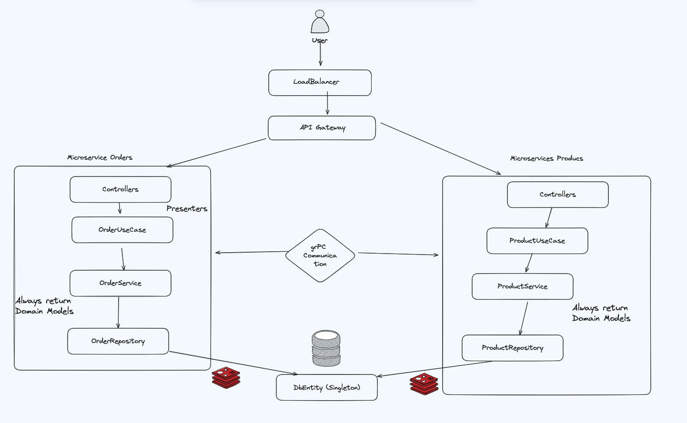

# Test API Best Practices

## Overview

This project is designed to assess the proficiency in designing and implementing microservices architectures using gRPC, NestJS, and Golang as an API gateway. The focus is on developing scalable, efficient, and secure back-end systems.

### Requirements

1. **Product Service (NestJS)**
   - Implement CRUD operations for products (Create, Read, Update, Delete).
   - Each product should have at least a name, description, price, and available quantity.

2. **Order Service (NestJS)**
   - Implement functionality to place an order. An order should reference one or more products and specify the quantities.
   - Implement a simple order listing functionality, which returns a list of all orders with product details.
   - Implement an interservice call to the Product service using gRPC to ensure that the product actually exists and has quantity available.

3. **API Gateway (Golang)**
   - Develop an API Gateway that exposes REST endpoints for the functionalities of the Product and Order Services.
   - Implement JWT authentication to secure the endpoints.
   - Add a rate limiting feature to protect the services from overuse (Bonus).

4. **gRPC**
   - Define gRPC protocols in a separate project.
   - Make sure to compile these and include them in respective projects as compiled gRPC protocols.

5. **gRPC Communication**
   - Establish gRPC communication between the microservices and the API Gateway.
   - Define the necessary Protobuf messages and services for the operations above.

6. **Unit Tests**
   - Write unit tests for the business logic of your application, including the data fetching and parsing logic.

7. **Bonus - Unit Tests (Optional)**
   - Write unit tests for Product and Order microservices to test business logic.

## Infrastructure

An overview of the microservices architecture used in this project is provided below. The architecture includes `orders-service`, `products-service`, and `api-gateway`:


## Improvements/TODOs

1. **Microservices**
   - **Internationalization (i18n)**: Add support for error customization and localization.
   - **Validations**: Use class-validator for better data validation.
   - **Folder Structure**: Adopt the same folder structure in `orders-service` as used in `products-service`.
   - **Documentation**: Utilize JSDoc for better documentation within the code.
   - **Testing**: Expand the test suite and add a coverage plan.

2. **API Gateway (Golang)**
   - Improve code structure and error handling.
   - Add more comprehensive tests for various edge cases.
   - Implement more sophisticated rate limiting.

## Running the Project

To run the project, follow these steps:

1. **Clone the Repository**

2. **Build and Run with Docker Compose**
```bash
docker-compose up --build
```

This command will build and start the orders-service, products-service, api-gateway, and the PostgreSQL database.

3. **Postman Collection**
A Postman collection is provided to test the REST API exposed by the API Gateway. Import the collection into Postman to use it.

4. **System Architecture**
The system is designed with the following architecture:



5. **API Gateway (Golang)**

- Exposes REST endpoints for the Product and Order services.
- Secures endpoints with JWT authentication.
- Includes rate limiting to protect from overuse.
- Product Service (NestJS)

- Handles CRUD operations for products.
- Ensures each product has a name, description, price, and available quantity.
- Order Service (NestJS)

- Manages order placements, ensuring products are available in the requested quantities via gRPC calls to the Product service.
- Lists all orders with detailed product information.
- gRPC Communication

- Facilitates communication between microservices and the API Gateway using Protobuf messages and services.
